# 意图识别系统流程图

## 流程图优化说明

本流程图基于专业评审建议进行了系统性优化，提升了准确性、可读性和专业性。主要优化包括：

### 优化要点
- **决策逻辑优化**: 将分散的判断条件合并为统一的决策节点，提升逻辑清晰度
- **上下文恢复机制**: 明确展示B2B无状态设计下的完整上下文恢复流程
- **视觉规范标准化**: 建立统一的色彩规范体系，提升文档专业性
- **规则精确表达**: 意图转移和打岔处理规则从分散变为集中精确表达

### 技术价值体现
- **理解门槛降低**: 更直观的流程表达减少学习成本
- **实现指导性强**: 精确的规则描述指导代码实现  
- **沟通效率提升**: 标准化的视觉语言促进团队沟通
- **设计理念体现**: 更好地展现了B2B无状态架构特点

## 流程图色彩规范

为保证流程图的一致性和可读性，采用以下标准化色彩方案：

- **蓝色 (#e1f5fe)**: 外部输入和起始节点
- **黄色 (#fff3e0)**: 警告或需要特殊处理的中间状态（如意图转移、歧义处理）
- **橙色 (#ffeb3b)**: 重要状态变更或关键决策点
- **紫色 (#f3e5f5)**: 外部系统调用（RAGFLOW、业务API）
- **绿色 (#e8f5e8)**: 成功或最终输出状态
- **红色 (#ffebee)**: 错误或失败路径

## 1. 无状态意图识别系统流程

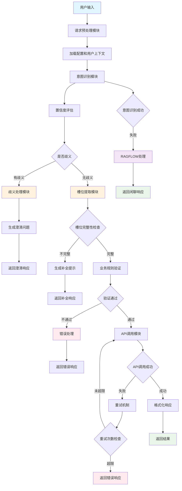

## 2. 意图识别详细流程

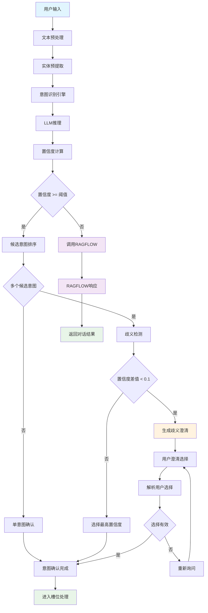

## 3. 槽位填充流程

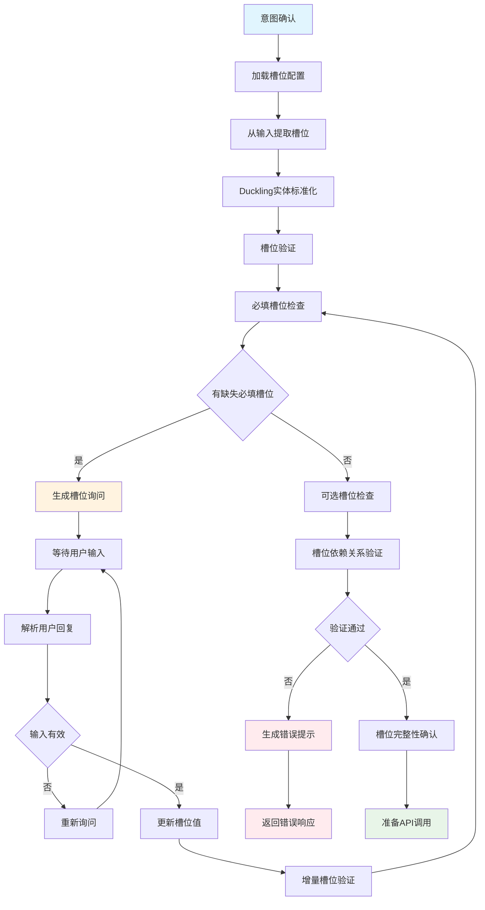

## 4. 意图转移和打岔处理流程

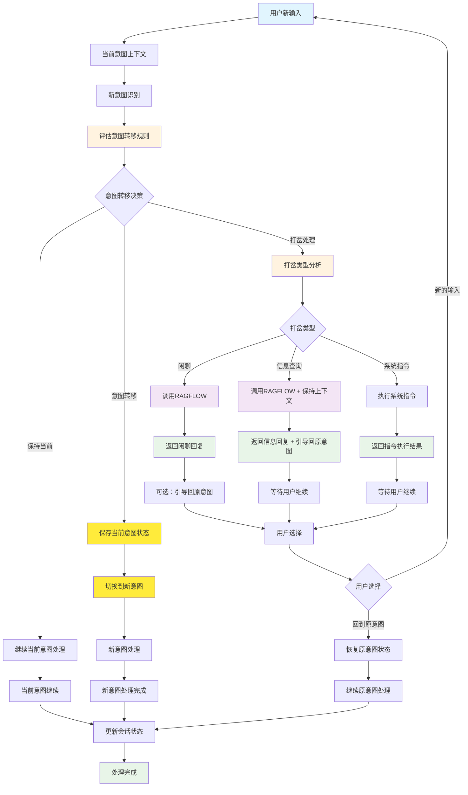

### 意图转移决策规则说明

**[评估意图转移规则]** 节点实现的复合判断逻辑：

1. **意图转移条件**: 
   - 新意图置信度 > 0.7 
   - 且 新意图置信度 > 当前意图置信度 + 0.1
   - 且 新意图与当前意图不同

2. **打岔处理条件**:
   - 新意图置信度 < 0.7
   - 或 新意图置信度 <= 当前意图置信度 + 0.1

3. **保持当前条件**:
   - 新意图与当前意图相同
   - 或 无明确的新意图识别结果

这种设计确保了意图转移的准确性，同时提供了灵活的打岔处理机制。

## 5. 上下文管理流程

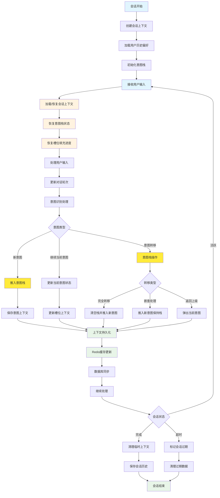

## 6. API调用处理流程

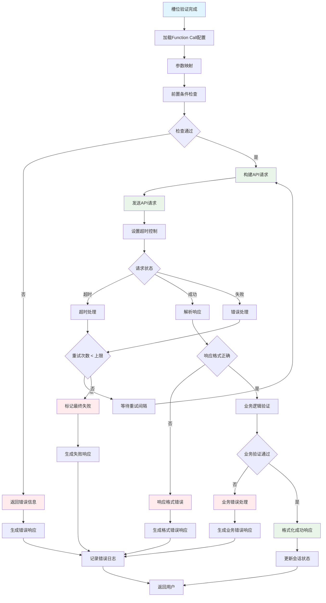

## 7. 错误处理和恢复流程

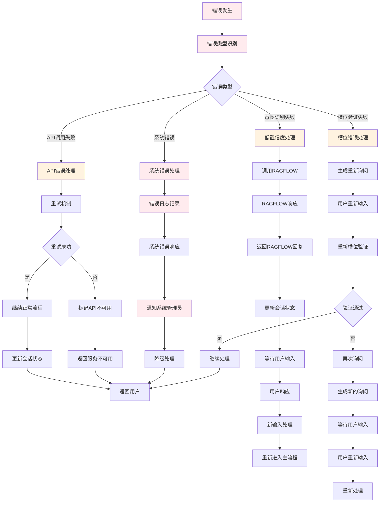

## 8. 性能优化流程

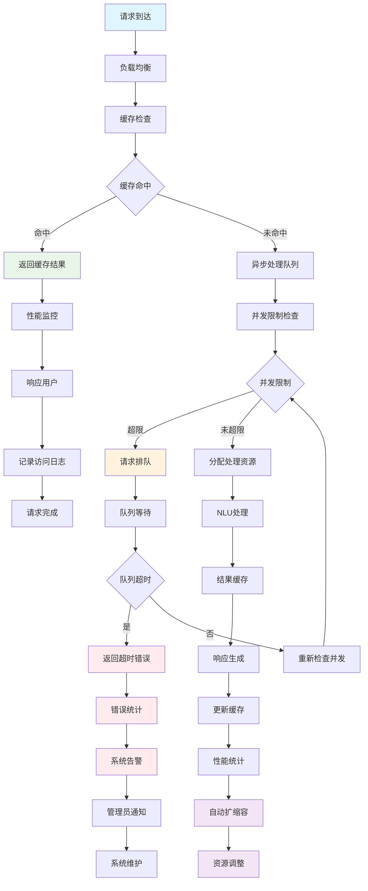

## 9. 系统监控流程

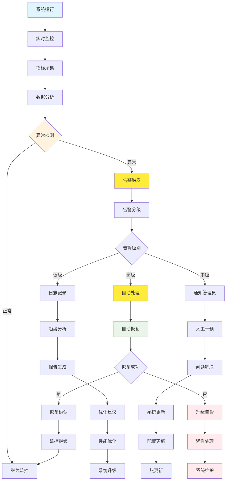

## 10. 数据流向图

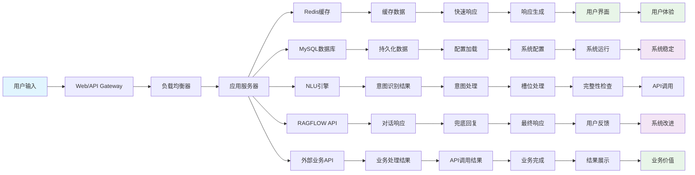

## 11. 混合Prompt Template配置流程

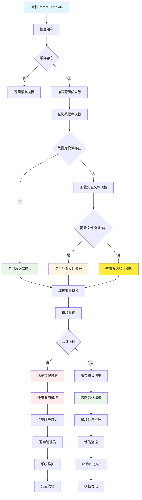

## 12. 安全防护流程

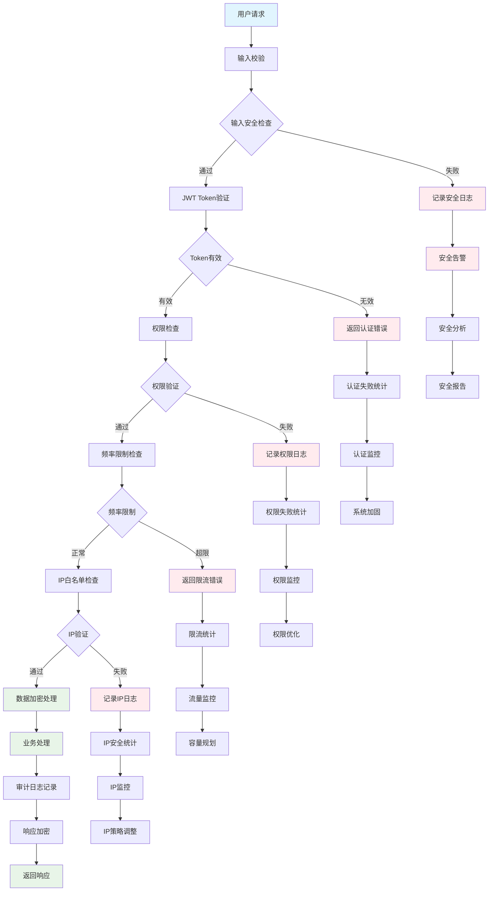