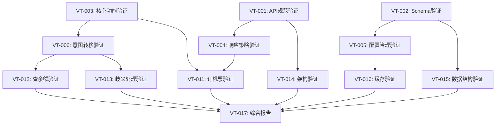

# 验证策略任务分解

## 概览

将验证策略分解为小型、独立的子任务，每个任务预估TOKEN用量和执行时间，可以分批次执行以避免TOKEN限制。

## 任务分解原则

- ✅ **独立性**: 每个任务可独立执行，不依赖其他任务结果
- 📊 **可衡量**: 每个任务有明确的输出和验证标准
- ⏱️ **时间控制**: 每个任务执行时间 ≤ 30分钟
- 🔢 **TOKEN估算**: 每个任务TOKEN用量 ≤ 50K

## 验证任务分解树

### 📋 阶段1: 基础验证任务 (Day 1-2)

#### VT-001: API接口规范验证
**预估时间**: 25分钟 | **TOKEN估算**: 40K | **优先级**: 🔴 High

**任务描述**: 验证API实现与设计规范一致性
**输入**: `docs/design/api_specification.md` + `src/api/v1/*.py`
**输出**: API一致性验证报告
**验证内容**:
- 所有设计的API端点是否实现
- 请求/响应参数是否符合规范
- 错误处理是否标准化
- 认证机制是否正确实现

**执行命令**:
```bash
# 创建并执行此任务
python scripts/verify_api_specification.py --output reports/api_verification.json
```

**验证标准**: 
- ✅ 所有API端点100%实现
- ✅ 参数格式100%匹配设计
- ✅ 错误处理标准化

---

#### VT-002: 数据库Schema一致性验证
**预估时间**: 20分钟 | **TOKEN估算**: 35K | **优先级**: 🔴 High

**任务描述**: 验证数据库实现与设计Schema一致
**输入**: `docs/design/mysql_schema.sql` + `src/models/*.py`
**输出**: 数据库一致性验证报告
**验证内容**:
- 表结构完整性检查
- 字段类型和约束验证
- 外键关系正确性
- 索引设计验证

**执行命令**:
```bash
python scripts/verify_mysql_schema.py --output reports/schema_verification.json
```

**验证标准**:
- ✅ 所有设计表100%创建
- ✅ 字段约束100%正确
- ✅ 关系映射100%匹配

---

#### VT-003: 核心功能需求验证
**预估时间**: 30分钟 | **TOKEN估算**: 45K | **优先级**: 🔴 High

**任务描述**: 验证核心意图识别和槽位填充功能
**输入**: `docs/requirement/function_list.md` + 核心服务代码
**输出**: 核心功能验证报告
**验证内容**:
- 意图识别准确性
- 槽位提取完整性
- 置信度计算正确性
- NLU引擎集成验证

**执行命令**:
```bash
pytest tests/verification/test_core_functions.py -v --tb=short
```

**验证标准**:
- ✅ 意图识别功能完全实现
- ✅ 槽位填充流程正确
- ✅ 置信度计算机制有效

---

### 📊 阶段2: 业务逻辑验证任务 (Day 3-4)

#### VT-004: 三层响应策略验证
**预估时间**: 25分钟 | **TOKEN估算**: 40K | **优先级**: 🟡 Medium

**任务描述**: 验证API调用、RAGFLOW回退、歧义澄清三层策略
**输入**: 业务逻辑代码 + 测试用例
**输出**: 响应策略验证报告
**验证内容**:
- API调用成功场景
- RAGFLOW回退机制
- 歧义澄清流程
- 策略路由正确性

**执行命令**:
```bash
python tests/verification/test_response_strategies.py
```

**验证标准**:
- ✅ 三层策略路由100%正确
- ✅ 回退机制有效工作
- ✅ 歧义处理流程完整

---

#### VT-005: 配置管理机制验证
**预估时间**: 20分钟 | **TOKEN估算**: 30K | **优先级**: 🟡 Medium

**任务描述**: 验证配置驱动架构和热更新机制
**输入**: 配置管理相关代码
**输出**: 配置管理验证报告
**验证内容**:
- MySQL配置加载
- Redis缓存机制
- 热更新功能
- 优先级策略

**执行命令**:
```bash
python tests/verification/test_configuration_management.py
```

**验证标准**:
- ✅ 配置加载机制正确
- ✅ 缓存更新及时
- ✅ 优先级策略有效

---

#### VT-006: 意图转移和槽位继承验证
**预估时间**: 30分钟 | **TOKEN估算**: 45K | **优先级**: 🟡 Medium

**任务描述**: 验证复杂对话管理功能
**输入**: 对话管理相关代码
**输出**: 对话管理验证报告
**验证内容**:
- 意图转移检测
- 槽位继承机制
- 上下文管理
- 意图栈操作

**执行命令**:
```bash
python tests/verification/test_conversation_management.py
```

**验证标准**:
- ✅ 意图转移正确检测
- ✅ 槽位继承机制有效
- ✅ 上下文管理完整

---

### 🔐 阶段3: 安全与性能验证任务 (Day 5-6)

#### VT-007: 安全机制验证
**预估时间**: 25分钟 | **TOKEN估算**: 35K | **优先级**: 🟡 Medium

**任务描述**: 验证系统安全功能实现
**输入**: 安全相关代码和配置
**输出**: 安全验证报告
**验证内容**:
- JWT认证机制
- API Key管理
- 输入安全防护
- 审计日志记录

**执行命令**:
```bash
python tests/verification/test_security_mechanisms.py
```

**验证标准**:
- ✅ 认证机制100%有效
- ✅ 输入防护完善
- ✅ 审计日志完整

---

#### VT-008: 性能指标验证
**预估时间**: 30分钟 | **TOKEN估算**: 40K | **优先级**: 🟡 Medium

**任务描述**: 验证系统性能满足设计要求
**输入**: 性能测试代码和基准数据
**输出**: 性能验证报告
**验证内容**:
- 响应时间<2s验证
- 并发处理能力
- 缓存效率测试
- 内存使用评估

**执行命令**:
```bash
python tests/verification/test_performance_requirements.py
```

**验证标准**:
- ✅ 响应时间达标
- ✅ 并发支持充足
- ✅ 缓存效率>80%

---

#### VT-009: 错误处理和重试机制验证
**预估时间**: 20分钟 | **TOKEN估算**: 30K | **优先级**: 🟢 Low

**任务描述**: 验证错误处理和恢复机制
**输入**: 错误处理相关代码
**输出**: 错误处理验证报告
**验证内容**:
- 异常捕获完整性
- 重试机制有效性
- 错误信息规范性
- 系统恢复能力

**执行命令**:
```bash
python tests/verification/test_error_handling.py
```

**验证标准**:
- ✅ 异常处理完善
- ✅ 重试机制有效
- ✅ 错误恢复正常

---

### 🔌 阶段4: 集成与业务场景验证 (Day 7-8)

#### VT-010: 外部服务集成验证
**预估时间**: 25分钟 | **TOKEN估算**: 40K | **优先级**: 🟡 Medium

**任务描述**: 验证与外部服务集成正确性
**输入**: 外部服务集成代码
**输出**: 集成验证报告
**验证内容**:
- LLM服务集成
- RAGFLOW服务集成
- Duckling集成
- API调用集成

**执行命令**:
```bash
python tests/verification/test_external_integrations.py
```

**验证标准**:
- ✅ 所有外部服务集成正常
- ✅ 错误处理机制完善
- ✅ 超时重试机制有效

---

#### VT-011: 订机票场景端到端验证
**预估时间**: 30分钟 | **TOKEN估算**: 45K | **优先级**: 🔴 High

**任务描述**: 验证订机票完整业务流程
**输入**: 订机票相关代码和测试数据
**输出**: 订机票场景验证报告
**验证内容**:
- 完整信息场景
- 信息缺失场景
- 槽位询问场景
- API调用场景

**执行命令**:
```bash
python tests/verification/test_flight_booking_e2e.py
```

**验证标准**:
- ✅ 所有订机票场景正常
- ✅ 槽位处理正确
- ✅ API调用成功

---

#### VT-012: 查余额场景验证
**预估时间**: 20分钟 | **TOKEN估算**: 30K | **优先级**: 🟡 Medium

**任务描述**: 验证查询银行卡余额流程
**输入**: 查余额相关代码
**输出**: 查余额验证报告
**验证内容**:
- 敏感信息处理
- 验证码流程
- 安全验证机制
- 结果返回格式

**执行命令**:
```bash
python tests/verification/test_balance_inquiry_e2e.py
```

**验证标准**:
- ✅ 敏感信息安全处理
- ✅ 验证流程完整
- ✅ 结果格式正确

---

#### VT-013: 歧义处理场景验证
**预估时间**: 25分钟 | **TOKEN估算**: 35K | **优先级**: 🟡 Medium

**任务描述**: 验证意图歧义检测和处理流程
**输入**: 歧义处理相关代码
**输出**: 歧义处理验证报告
**验证内容**:
- 歧义检测准确性
- 澄清问题生成
- 用户选择解析
- 意图确认机制

**执行命令**:
```bash
python tests/verification/test_ambiguity_resolution_e2e.py
```

**验证标准**:
- ✅ 歧义检测准确
- ✅ 澄清问题合理
- ✅ 选择解析正确

---

### 📊 阶段5: 架构与一致性验证 (Day 9-10)

#### VT-014: 系统架构流程验证
**预估时间**: 30分钟 | **TOKEN估算**: 45K | **优先级**: 🟡 Medium

**任务描述**: 验证代码实现与架构设计一致性
**输入**: `docs/design/intent_recognition_flowchart.md` + 实现代码
**输出**: 架构一致性验证报告
**验证内容**:
- 流程节点实现验证
- 数据流向正确性
- 组件交互验证
- 架构设计符合性

**执行命令**:
```bash
python tests/verification/test_architecture_consistency.py
```

**验证标准**:
- ✅ 流程实现与设计一致
- ✅ 数据流向正确
- ✅ 组件交互符合设计

---

#### VT-015: 数据结构一致性验证
**预估时间**: 20分钟 | **TOKEN估算**: 30K | **优先级**: 🟢 Low

**任务描述**: 验证数据结构与设计文档一致
**输入**: `docs/design/data_structure_examples.md` + 实现代码
**输出**: 数据结构验证报告
**验证内容**:
- 请求响应格式
- 数据模型结构
- 字段定义一致性
- 嵌套结构正确性

**执行命令**:
```bash
python tests/verification/test_data_structure_consistency.py
```

**验证标准**:
- ✅ 数据格式100%匹配
- ✅ 字段定义正确
- ✅ 嵌套结构合理

---

#### VT-016: Redis缓存机制验证
**预估时间**: 25分钟 | **TOKEN估算**: 35K | **优先级**: 🟡 Medium

**任务描述**: 验证Redis缓存设计与实现一致性
**输入**: `docs/design/redis_cache_examples.md` + 缓存实现代码
**输出**: 缓存机制验证报告
**验证内容**:
- 缓存键命名规范
- TTL设置正确性
- 缓存更新策略
- 性能优化效果

**执行命令**:
```bash
python tests/verification/test_redis_cache_consistency.py
```

**验证标准**:
- ✅ 缓存键规范统一
- ✅ TTL设置合理
- ✅ 更新策略有效

---

### 📈 阶段6: 报告生成与总结 (Day 11)

#### VT-017: 综合验证报告生成
**预估时间**: 30分钟 | **TOKEN估算**: 40K | **优先级**: 🔴 High

**任务描述**: 汇总所有验证结果，生成综合报告
**输入**: 所有子任务验证结果
**输出**: 综合验证报告和改进建议
**验证内容**:
- 需求覆盖率统计
- 实现质量评估
- 问题清单汇总
- 改进建议制定

**执行命令**:
```bash
python scripts/generate_comprehensive_verification_report.py
```

**输出文件**:
- `reports/comprehensive_verification_report.html`
- `reports/requirements_coverage_matrix.xlsx`
- `reports/implementation_gaps.json`

---

## 执行计划建议

### 第一周执行计划

| 天数 | 任务编号 | 任务名称 | 预估时间 | 优先级 |
|------|----------|----------|----------|--------|
| Day 1 | VT-001 | API接口规范验证 | 25分钟 | 🔴 High |
| Day 1 | VT-002 | 数据库Schema验证 | 20分钟 | 🔴 High |
| Day 2 | VT-003 | 核心功能需求验证 | 30分钟 | 🔴 High |
| Day 2 | VT-004 | 三层响应策略验证 | 25分钟 | 🟡 Medium |
| Day 3 | VT-005 | 配置管理机制验证 | 20分钟 | 🟡 Medium |
| Day 3 | VT-006 | 意图转移槽位继承验证 | 30分钟 | 🟡 Medium |
| Day 4 | VT-007 | 安全机制验证 | 25分钟 | 🟡 Medium |
| Day 4 | VT-008 | 性能指标验证 | 30分钟 | 🟡 Medium |

### 第二周执行计划

| 天数 | 任务编号 | 任务名称 | 预估时间 | 优先级 |
|------|----------|----------|----------|--------|
| Day 5 | VT-009 | 错误处理重试验证 | 20分钟 | 🟢 Low | c
| Day 5 | VT-010 | 外部服务集成验证 | 25分钟 | 🟡 Medium |
| Day 6 | VT-011 | 订机票场景验证 | 30分钟 | 🔴 High |
| Day 6 | VT-012 | 查余额场景验证 | 20分钟 | 🟡 Medium |
| Day 7 | VT-013 | 歧义处理场景验证 | 25分钟 | 🟡 Medium |
| Day 7 | VT-014 | 系统架构流程验证 | 30分钟 | 🟡 Medium |
| Day 8 | VT-015 | 数据结构一致性验证 | 20分钟 | 🟢 Low |
| Day 8 | VT-016 | Redis缓存机制验证 | 25分钟 | 🟡 Medium |
| Day 9 | VT-017 | 综合验证报告生成 | 30分钟 | 🔴 High |

## 任务依赖关系



## 执行指南

### 每日执行模板
```bash
# 每日验证任务执行模板
echo "📅 开始执行 Day X 验证任务"
echo "🎯 目标任务: VT-XXX"

# 1. 准备工作
echo "📋 准备验证环境..."
source venv/bin/activate
cd /path/to/app711

# 2. 执行验证任务
echo "🚀 执行验证任务..."
python tests/verification/test_xxx.py

# 3. 生成报告
echo "📊 生成验证报告..."
mv verification_results.json reports/VT-XXX_results.json

# 4. 记录进度
echo "✅ 任务 VT-XXX 执行完成"
echo "📈 进度: X/17 任务完成"
```

### 质量检查点
- **每完成3个任务**: 检查结果一致性
- **每完成一个阶段**: 生成阶段性报告
- **发现问题**: 立即记录到问题跟踪清单

## 风险控制

### TOKEN用量监控
- 每个任务前预估TOKEN使用
- 实际使用超出预估20%时暂停分析
- 优化验证脚本减少TOKEN消耗

### 时间管理
- 严格控制每任务30分钟时限
- 超时任务分解为更小子任务
- 优先执行高优先级任务

### 质量保障
- 每个验证结果要有具体数据支撑
- 问题清单要有明确解决方案
- 验证标准要可量化可重现

## 总结

通过这种分解方式，我们可以：
- ✅ **分批执行**: 每次处理1-2个任务，避免TOKEN限制
- ✅ **优先级管理**: 先执行高优先级核心功能验证
- ✅ **进度追踪**: 清晰的任务划分便于跟踪进度
- ✅ **质量保障**: 每个任务都有明确的验证标准
- ✅ **灵活调整**: 可根据实际情况调整任务顺序

建议从VT-001开始执行，每天完成1-2个验证任务，预计11天完成全部验证工作。